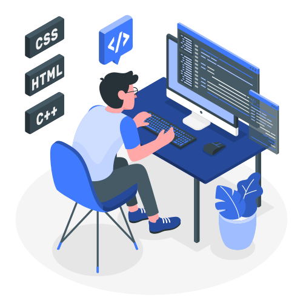

<!--
**guiiim/guiiim** is a ✨ _special_ ✨ repository because its `README.md` (this file) appears on your GitHub profile.

Here are some ideas to get you started:

- 🔭 I’m currently working on ...
- 🌱 I’m currently learning ...
- 👯 I’m looking to collaborate on ...
- 🤔 I’m looking for help with ...
- 💬 Ask me about ...
- 📫 How to reach me: ...
- 😄 Pronouns: ...
- ⚡ Fun fact: ...

-->

<h1 align="center">Hi 👋, I'm Guilherme Magalhães</h1>
<h3 align="center">Microsoft Power Platform Tech Lead</h3>

I am a Computer Engineer, digital enthusiasts, self-taught and can work alone or with teams.  Moved by challenges and open to every new experience.

 <i>
 
  
    Professional with 10 years of experience, working 3 years in digital solutions in a large multi-national company of consumer goods with solid knowledge in requirement analysis, process mapping, development of Business Cases and creation of solutions for data transformation with Power Platform toolkit.
 
</i>

 <i>
Solid knowledge of UI/UX.  
Work experience in:
 &emsp;Development of digital applications with Power Apps and C#.
 &emsp;Data Viz with Power BI.
 &emsp;Development of RPAs with UiPath, Power Automate and VBA.
 &emsp;Management and implementation of digital projects.
 &emsp;Agile and waterfall frameworks.
 &emsp;Design Thinking.
</i>

